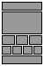

# more layouts
Some additional layouts for Backdrop CMS, that were not included in core.

This project won't be duplicating existing layouts from other contributors. I suggest you check the [Backdrop Contrib](https://github.com/backdrop-contrib) repo for more layout projects.

## Layouts included

**1/3/4**: similar to the default Bartik layout (3/3/4), but with a single column content area (no sidebars). Good for building landing pages or home pages.

## Using the layouts
Either clone this repo in your /layouts directory, or just copy the individual layout folders you wish to use into /layouts